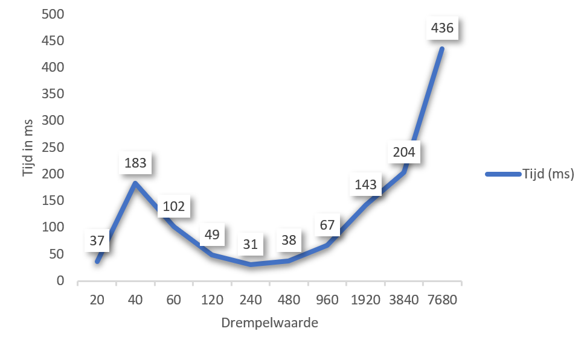
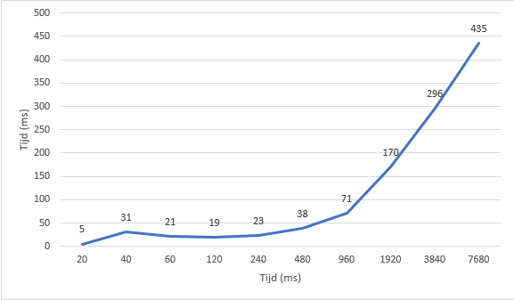

#Opdracht 1

##Opgave 1.1
####Opdracht
_Schrijf een Java-programma dat een instelbaar aantal gehele getallen genereert en deze in een array
plaats. Sorteer deze getallen met behulp van bubble sort.
Bepaal nu hoeveel tijd je programma nodig heeft om de array te sorteren. Test je programma in ieder
geval 25.000, 50.000, 100.000, 200.000 en 400.000 getallen en toon de resultaten in je verslag. Wat
valt je op aan de resultaten?_

####Resultaten
Aantal | Tijd
  ---  | ---
  25.000 | 3 seconden
  50.000 | 12 seconden
  100.000 | 49 seconden 
  200.000 | 3 minuten 45 seconden
  400.000 | 16 minuten 9 seconden

####Conclusie
Hieruit kunnen we concluderen dat voor elke verdubbeling van nummers, de tijd ongeveer 4x langer wordt.
Want als we dit uitrekenen is dit het verschil:

Nummers | Berekening (seconden) | Verschil vorige meting
--- | --- | ---
25.000 > 50.000 | 12 / 3 | 4x
50.000 > 100.000 | 49 / 12 | 4.1x
100.000 > 200.000 | 225 / 49 | 4.6x
200.000 > 400.000 | 969 / 225 | 4.3x

##Opgave 1.2

####Opdracht
_Doe hier hetzelfde als in opdracht 1.1, maar splits nu de array vóór het sorteren in twee helften. Sorteer
  elke array daarna (achterelkaar, in dezelfde thread). Na het sorteren moet je de twee gesorteerde
  lijsten uiteraard weer samenvoegen.
  Hoeveel tijd was er nu nodig voor het sorteren? Welke relatie is er tussen deze meetresultaten en die
  van de vorige opdracht? Hoe verklaar je dit?_

####Resultaten
Nummers | Tijd
--- | ---
  25.000 | 2 seconden
  50.000 | 7 seconden
  100.000 | 31 seconden
  200.000 | 2 minuten 9 seconden
  400.000 | 

####Conclusie
We kunnen stellen dat er een relatie is tussen de vorige opdracht. Deze manier is namelijk ongeveer 1.6x zo snel.

#####Verschillen in een tabel
  Nummers | Opgave 1.1             | Opgave 1.2            | Verschil               | Aantal keer sneller    
  ------- | ---------------------- | --------------------- | ---------------------  | -------------------
  25.000  | 3 seconden             | 2 seconden            | 1 seconde              | 1.5x
  50.000  | 12 seconden            | 7 seconden            | 5 seconden             | 1.7x
  100.000 | 49 seconden            | 31 seconden           | 18 seconden            | 1.6x
  200.000 | 3 minuten 45 seconden  | 2 minuten 10 seconden | 1 minuut 35 seconden   | 1.7x
  400.000 | 16 minuten 9 seconden  | 9 minuten 38 seconden | 10 minuten 27 seconden | 1.7x

##Opgave 1.3

####Opdracht
_Doe hier hetzelfde als in opdracht 1.2, maar laat nu de twee helften van de array door 2 threads
 uitvoeren die ieder hun eigen helft sorteren. De main thread kan daarna de gesorteerde helften weer
 samenvoegen tot één gesorteerde array.
 Hoeveel tijd was er nu nodig voor het sorteren? Wat is de relatie tussen deze meetresultaten en die
 van de vorige twee opdrachten? Hoe verklaar je dit?_
 
####Resultaten
  Nummers | Tijd
  ------- | ---
  25.000  | 1 seconde
  50.000  | 4 seconden
  100.000 | 17 seconden
  200.000 | 1 minuut 18 seconden
  400.000 | 6 minuten

####Conclusie
Omdat twee rijen nu worden verdeeld over twee threads moet dit 2x zo snel zijn. Echter zal er na het sorteren nog een merge moeten plaats vinden. En dat kost natuurlijk ook tijd.
De relatie met de vorige twee opdrachten is hierin duidelijk. De eerste opdracht had geen opverdeling. De tweede opdracht wel, maar dan over 1 thread. Deze opdracht is vergeleken met de vorige opdrachten het meest efficient.

 Nummers  | Opgave 1.2             | Opgave 1.3             | Verschil               | Aantal keer sneller    
  ------- | ---------------------- | --------------------- | ---------------------  | -------------------
  25.000  | 2 seconden             | 1 seconden            | 1 seconde              | 2x
  50.000  | 7 seconden             | 4 seconden            | 3 seconden             | 1.8x
  100.000 | 31 seconden            | 17 seconden           | 14 seconden            | 1.8x
  200.000 | 2 minuten 10 seconden  | 1 minuten 18 seconden | 52 seconden            | 1.7x
  400.000 | 9 minuten 38 seconden  | 6 minuten             | 6 minuten 38 seconden  | 1.6x

##Opgave 1.4

####Opdracht
_Maak nu een programma waarin bij het sorteren van de array deze weer in twee helften wordt gesplitst
zoals in opdracht 1.2. Start ook nu voor elke helft weer een thread, waarbij elke thread verantwoordelijk
is voor het sorteren van zijn deel van de lijst._

_Dit keer echter bekijkt de thread hoeveel nummers er gesorteerd moeten worden. Is dit meer dan een
bepaalde drempelwaarde, dan zal de thread 2 nieuwe threads aanmaken die ieder weer één helft van
de lijst sorteren. Zijn die threads klaar, dan voegt de thread de twee (gesorteerde) arrays weer samen.
Op die manier ontstaat dus een ‘boom’ van actieve threads.
Threads die hun werk niet gaan ‘outsourcen’ sorteren de arrays weer met bubble sort._

####Resultaten

| Drempelwaarde | Tijd (MS) |
| ------------- | --------- |
| 20            | 37        |
| 40            | 183       |
| 60            | 102       |
| 120           | 49        |
| 240           | 31        |
| 480           | 38        |
| 960           | 67        |
| 1920          | 143       |
| 3840          | 204       |
| 7680          | 436       |

**Grafiek**

####Conclusie
Het verlagen van de drempelwaarde leverde geen resultaat meer op na het verlagen van 240 naar 120.
Dit is te verklaren omdat de bubbelsort na deze waarde sneller is dan een nieuwe threads aanmaken en daarop wachten.

##Opgave 1.5

####Opdracht
_De vorige opdracht was een typisch voorbeeld van een divide-and-conquer strategie om een probleem
 op te lossen. Java heeft een speciaal framework om dit soort oplossingen te implementeren:
 RecursiveTask in combinatie met een ForkJoin-threadpool.
 Maak een versie van je programma waarbij je niet zelf de threads maakt (zoals in opdracht 1.4), maar
 een ForkJoin threadpool gebruikt, samen met de RecursiveTask.
 Bepaal nu weer hoe lang je programma nodig heeft om te sorteren. Hoe vergelijken de tijden met die
 van opdracht 1.4? Hoeveel threads denk je dat gebruikt worden door de ForkJoin-pool (leg uit waarom
 je dat denkt)?_
 
 20: 5ms
 40: 31ms
 60: 21ms
 120: 19ms
 240: 23ms
 480: 38ms
 960: 71ms
 1920: 170ms
 3840: 296ms
 7680: 435ms
####Resultaten

| Drempelwaarde | Tijd (MS) |
| ------------- | --------- |
| 20            | 5         |
| 40            | 31        |
| 60            | 21        |
| 120           | 19        |
| 240           | 23        |
| 480           | 38        |
| 960           | 71        |
| 1920          | 170       |
| 3840          | 296       |
| 7680          | 435       |

**Grafiek**

####Conclusie
Als we de resultataten vergelijken dan zien we dat de ForkJoinPool aanzienelijk sneller is in de optimale range (40-480 nummers).
Echter bij de hogere nummers (960-7680) zijn de resultaten ongeveer gelijk en is er geen sprake van een meetbare tijdswinst.
  
Voor de grootte van de Pool geldt: meten = weten. Dit meten we met de methode `getPoolSize()` De pool grootte is consequent '8' met 25000 getallen om te sorteren.  
Dit is te verklaren omdat er gestolen wordt. Bijvoorbeeld bij 20 getallen wordt er 41 keer gesteeld.